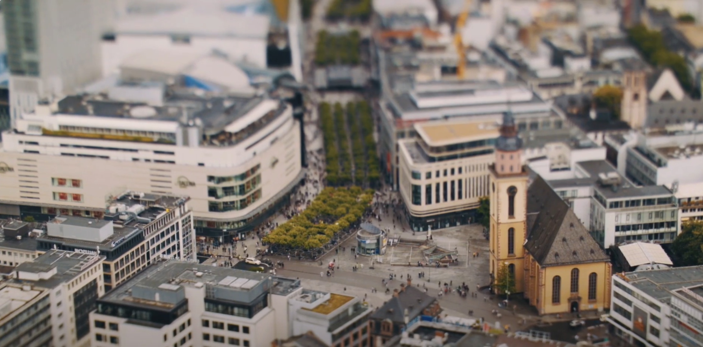

# Zfan0427_9103_tut4
## How to interact with this project
- This project **doesn't** require any interaction, just watch the animation and see how it changes. The small rectangles will start moving when page loading complete, and the background colour will become darker and darker by time goes, and small rectangles number will decrease by the background goes darker.
### Specific information
- This project is a **time-based** animation project.
- In this project, small rectangles will start moving, and background colour will goes deeper by time, small rectangles number also decrease by the time goes.
- This project was inspired by this video below.

[Link to the video](https://www.youtube.com/watch?v=N9--0hx5hVE)
- This video provides me an idea to make this project animation to look like a *tilt shift photography*, since the original iamge looks like a big city and small rectangles looks like people and cars on the street, therefore the animation is to create a effect that people are walking on the street, the sky from day to night and people slowly decrease by the sky gets darker.
- I created multiple arrays to store small rectangles, roads and buildings. I mainly using if statement to detect next destination for small rectangels and colour, also change the direction of small rectangles. I also used if statment for set time event, let sky change colour by a certian time. I used a lot of loops to create small rectangles and combine with if statement.